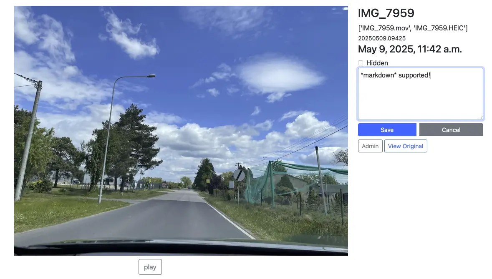

Based on [django-boilerplate], a more modern replacement of my ancient (2005ish)
GalleryMaker (C#+GDI) code, this time as a django webapp.

Very much a work-in-progress, bad UI, but basic functionality is there.
 1. Create a new gallery in the UI.
 2. `./manage.py importimages $IMAGE_FOLDER $GALLERY_ID` to load photos
       - All the photos have to be in that directory
       - You can run this again when you add new photos
 3. Click into gallery and add captions in browser.
 4. Re-order images by using the Admin button :/
 5. Then `./manage.py buildgallery` to emit standalone html in the `publish` folder.
 6. If you want extra files, like images to use in the text that aren’t
    entries, put them in `media/public` in the gallery directory, and
    they’ll work in the editor and also be copied over to the publish
    directory.

I guess the main new features over GalleryMaker are:
  - Supports video
  - Supports live photos (heic+mov file with same basename)

Not great code, but at least [Junie] was fast—until I exceeded some limits that
is. I guess they don’t expect you to run it in several IDEs in parallel for 4+
straight hours?

[django-boilerplate]: https://github.com/andrewdotn/django-boilerplate
[Junie]: https://www.jetbrains.com/junie/

## Tips

### Exporting edited live photos

If you have an apple ‘live photo’ in Photos.app, the normal ‘export’ option
just gives you a still image, and ‘export unmodified original’ ignores your
edits such as cropping.

However [osxphotos] can do this. Here’s the command line I use to re-export
a single image:

    osxphotos export --ignore-exportdb --overwrite \
        --skip-original-if-edited --edited-suffix '' \
        --name IMG_1234.HEIC --year 2025 \
        .

[osxphotos]: https://github.com/RhetTbull/osxphotos

### Saving HDR files from Photoshop

I haven’t implemented HDR for thumbnails yet. But trying to enable an HDR
workflow for edits in anticipation of that, edits beyond what Photos.app
can do—

  - Recent photoshop can open HDR .HEIC images via Camera Raw. Imported
    into photoshop keeps them HDR as long as you edit in 32-bit mode with
    some of the corresponding limitations for that. See [this
    guide][gregbenz-hdr] for some tips.

      - You might need to flip Settings → Technology Previews → Precise
        Color Management for HDR Display.

      - Also see Camera Raw → Settings icon in upper right → File Handling
        → JPEG, HEIC, and TIFF Handling

  - All the apparently-useful export options in photoshop seem to lose the
    HDR, *except* Filter → Camera Raw Filter → the “Convert and Save Image”
    in the upper-right corner to save as HDR-aware JPG or AVIF.
